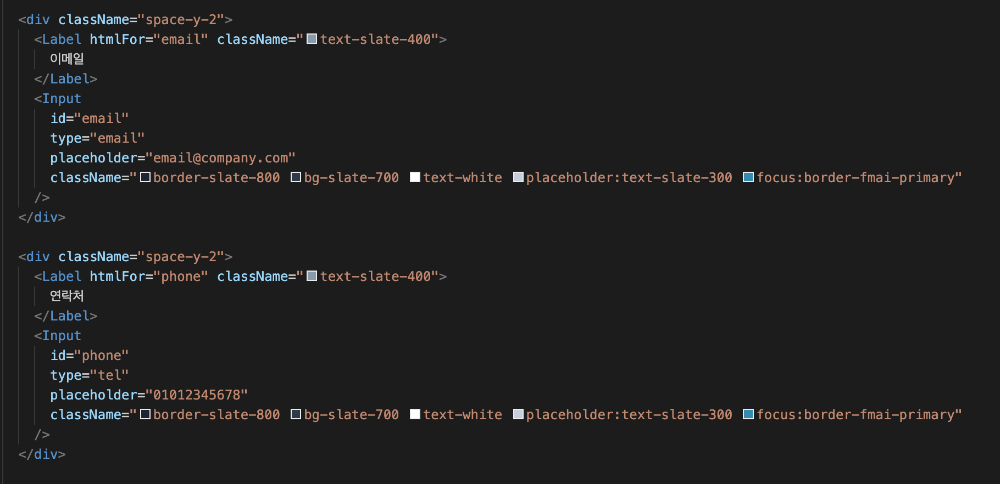

# FMAI 색상 시스템

## 목적

- 일관된 브랜드 아이덴티티 유지
- 라이트/다크 모드 자동 대응 (CSS 변수 기반)
- Tailwind 클래스 자동완성 + 투명도(`bg-fmai-primary/20`) 지원

## VSCode 확장 추천

FMAI 색상을 효율적으로 사용하려면 다음 확장을 설치하세요:

### 1. Tailwind CSS IntelliSense (필수)

- **ID**: `bradlc.vscode-tailwindcss`
- **기능**:
  - FMAI 커스텀 색상 자동완성 (`fmai-primary`, `fmai-secondary` 등)
  - 클래스명 입력 시 색상 미리보기 (HEX 값으로 정의된 경우)
  - 호버 시 색상 정보 표시
  - 투명도 지원 (`bg-fmai-primary/50`)

    

### 2. Color Highlight (권장)

- **ID**: `naumovs.color-highlight`
- **기능**:
  - CSS 변수 색상 하이라이트
  - HEX, RGB, HSL 값 시각적 표시
  - `globals.css`에서 색상 정의 확인 시 유용

### 설정 팁 (`settings.json`):

```json
{
  "tailwindCSS.experimental.classRegex": ["fmai-.*"],
  "editor.quickSuggestions": { "strings": true }
}
```

## 사용 원칙 (간단)

| 구분      | 토큰             | 주요 용도            | 비고           |
| --------- | ---------------- | -------------------- | -------------- |
| Primary   | `fmai-primary`   | 메인 CTA, 강조       | Blue-Cyan 계열 |
| Secondary | `fmai-secondary` | 보조 링크/아이콘     | Cyan           |
| Accent    | `fmai-accent`    | 액센트 하이라이트    | Teal           |
| Info      | `fmai-info`      | 정보/분석/차트       | Blue           |
| Purple    | `fmai-purple`    | AI/ML 관련           | Purple         |
| Pink      | `fmai-pink`      | 특별 기능/하이라이트 | Pink           |
| Indigo    | `fmai-indigo`    | 빅데이터/엔지니어링  | Indigo         |
| Amber     | `fmai-amber`     | 경고(주의)           | Amber          |
| Orange    | `fmai-orange`    | 에너지/활력          | Orange         |
| Red       | `fmai-red`       | 오류/위험            | Red            |

각 색상은 변형: `DEFAULT`, `light`, `dark` (예: `bg-fmai-primary-light`, `text-fmai-accent-dark`).

## HSL 값 요약

| 토큰           | DEFAULT     | LIGHT       | DARK        |
| -------------- | ----------- | ----------- | ----------- |
| fmai-primary   | 196 67% 45% | 196 67% 55% | 196 67% 35% |
| fmai-secondary | 189 94% 43% | 189 94% 53% | 189 94% 33% |
| fmai-accent    | 173 80% 40% | 173 80% 50% | 173 80% 30% |
| fmai-info      | 217 91% 60% | 217 91% 70% | 217 91% 50% |
| fmai-purple    | 271 81% 56% | 271 81% 66% | 271 81% 46% |
| fmai-pink      | 330 81% 60% | 330 81% 70% | 330 81% 50% |
| fmai-indigo    | 239 84% 67% | 239 84% 77% | 239 84% 57% |
| fmai-amber     | 45 93% 47%  | 45 93% 57%  | 45 93% 37%  |
| fmai-orange    | 25 95% 53%  | 25 95% 63%  | 25 95% 43%  |
| fmai-red       | 0 84% 60%   | 0 84% 70%   | 0 84% 50%   |

## HEX 값 요약

Color Highlight 확장에서 즉시 시각 확인이 가능하도록 모든 변형의 HEX 값을 함께 제공합니다. (HSL → HEX 변환, Tailwind 기본 팔레트 기준과 동일 계열)

| 토큰           | DEFAULT | LIGHT   | DARK    |
| -------------- | ------- | ------- | ------- |
| fmai-primary   | #2596BE | #51ABCB | #1F6C86 |
| fmai-secondary | #06b6d4 | #22d3ee | #0891b2 |
| fmai-accent    | #14b8a6 | #2dd4bf | #0d9488 |
| fmai-info      | #3b82f6 | #60a5fa | #2563eb |
| fmai-purple    | #a855f7 | #c084fc | #9333ea |
| fmai-pink      | #ec4899 | #f472b6 | #db2777 |
| fmai-indigo    | #818cf8 | #a5b4fc | #6366f1 |
| fmai-amber     | #f59e0b | #fbbf24 | #d97706 |
| fmai-orange    | #f97316 | #fb923c | #ea580c |
| fmai-red       | #ef4444 | #f87171 | #dc2626 |

> TIP: 컴포넌트에서 HEX가 필요한 특정 라이브러리(예: 외부 차트 테마 커스터마이징)에는 위 HEX 값을 직접 사용하거나 `hsl(var(--fmai-*))/투명도`를 그대로 전달할 수 있습니다.

## 기본 예시 & 그라디언트 유틸리티

`globals.css` 에 정의된 반복 3색 그라디언트 유틸: `.text-fmai-gradient`, `.bg-fmai-gradient`

| 클래스                | 목적              | Light 모드                                                            | Dark 모드                                           |
| --------------------- | ----------------- | --------------------------------------------------------------------- | --------------------------------------------------- |
| `.text-fmai-gradient` | 텍스트 그라디언트 | from-fmai-primary-light via-fmai-secondary-light to-fmai-accent-light | from-fmai-primary via-fmai-secondary to-fmai-accent |
| `.bg-fmai-gradient`   | 배경 그라디언트   | 동일                                                                  | 동일                                                |

마이그레이션 (예시):

| 기존 체인                                                                                                              | 유틸 대체            |
| ---------------------------------------------------------------------------------------------------------------------- | -------------------- |
| `bg-gradient-to-r from-fmai-primary-light via-fmai-secondary-light to-fmai-accent-light`                               | `bg-fmai-gradient`   |
| `bg-gradient-to-r from-fmai-primary-light via-fmai-secondary-light to-fmai-accent-light bg-clip-text text-transparent` | `text-fmai-gradient` |

```tsx
// 버튼 (기본 + 호버 + 다크 변형)
<Button className="bg-fmai-primary hover:bg-fmai-primary-dark text-white" />

// 배경 그라디언트 (권장: 유틸 사용)
<div className="bg-fmai-gradient h-10 w-full rounded-md" />

// 텍스트 그라디언트 (권장: 유틸 사용)
<h1 className="text-fmai-gradient text-5xl font-bold">브랜드 타이틀</h1>

// 투명도 활용 (배경 블러 오브젝트)
<div className="bg-fmai-secondary/15 blur-3xl rounded-full" />

// 경고/위험 배지
<Badge className="bg-fmai-amber/15 text-fmai-amber-light" />
<Badge className="bg-fmai-red/15 text-fmai-red-light" />

// 차트 색상 매핑 (예시)
const chartColors = {
  soc: 'hsl(var(--fmai-info))',
  soh: 'hsl(var(--fmai-secondary))',
  temperature: 'hsl(var(--fmai-amber))',
  current: 'hsl(var(--fmai-accent))',
};
```

## 다크 모드

- 동일한 토큰을 그대로 사용하면 `.dark` 컨텍스트에서 자동으로 다크 변형 값 적용 (CSS 변수 교체)
- 필요 시 명시적 변형: `bg-fmai-primary-dark` (강제)
- 그라디언트 유틸은 `.dark` 컨텍스트에서 자동으로 진한 톤(기본 변형)으로 전환됨 → 별도 클래스 추가 불필요

## 마이그레이션 (요약)

| 기존 Tailwind    | 신규 FMAI 토큰      |
| ---------------- | ------------------- |
| `bg-emerald-500` | `bg-fmai-primary`   |
| `bg-cyan-500`    | `bg-fmai-secondary` |
| `bg-teal-500`    | `bg-fmai-accent`    |
| `bg-blue-500`    | `bg-fmai-info`      |
| `bg-purple-500`  | `bg-fmai-purple`    |
| `bg-pink-500`    | `bg-fmai-pink`      |
| `bg-indigo-500`  | `bg-fmai-indigo`    |
| `bg-amber-500`   | `bg-fmai-amber`     |
| `bg-orange-500`  | `bg-fmai-orange`    |
| `bg-red-500`     | `bg-fmai-red`       |

## 트러블슈팅 (간단)

| 문제                    | 해결                                              |
| ----------------------- | ------------------------------------------------- |
| 색상 자동완성 안 뜸     | Tailwind IntelliSense 설치 및 `content` 경로 확인 |
| 투명도(`/20`) 적용 안됨 | HSL 변수 형식 유지(숫자/퍼센트 사이 공백 유지)    |
| 다크 모드에서 동일 색상 | `.dark` 클래스 body에 적용 여부 확인              |

## 참고

- `globals.css` 에서 CSS 변수 정의
- `tailwind.config.ts` 의 `theme.extend.colors.fmai.*` 확인

---

최종 업데이트: 2025-11-25 / 버전: 0.3.0
문의: contact@futuremobility.ai

# FMAI 색상 시스템 (상세)

퓨처모빌리티AI 브랜드의 일관된 색상 시스템입니다. 모든 컴포넌트는 Tailwind CSS 커스텀 색상과 CSS 변수를 통해 테마를 지원합니다.

## 목차

- [개요](#개요)
- [색상 팔레트](#색상-팔레트)
- [사용 방법](#사용-방법)
- [CSS 변수](#css-변수)
- [Tailwind 설정](#tailwind-설정)
- [마이그레이션 가이드](#마이그레이션-가이드)

## 개요

FMAI 색상 시스템은 **브랜드 일관성**과 **다크 모드 지원**을 위해 설계되었습니다. 각 색상은 3가지 변형(DEFAULT, light, dark)을 제공하며, HSL 형식의 CSS 변수로 관리됩니다.

### 장점

- **일관성**: 모든 페이지와 컴포넌트에서 동일한 브랜드 색상 사용
- **유지보수성**: 색상 변경 시 한 곳만 수정 (globals.css)
- **다크 모드**: 라이트/다크 테마 자동 전환
- **타입 안전성**: Tailwind 자동완성 지원
- **접근성**: 충분한 명암 대비 제공

## 색상 팔레트

### Primary (주요 색상)

데이터 신뢰성과 기술력의 **청명함**을 나타내는 블루-사이언 계열 (업데이트된 브랜드 톤)

| 변형    | 값                   | HSL           | Hex       | 용도                     |
| ------- | -------------------- | ------------- | --------- | ------------------------ |
| Default | `fmai-primary`       | `196 67% 45%` | `#2596BE` | 주요 버튼, 강조 요소     |
| Light   | `fmai-primary-light` | `196 67% 55%` | `#51ABCB` | 호버 상태, 밝은 배경     |
| Dark    | `fmai-primary-dark`  | `196 67% 35%` | `#1F6C86` | 액티브 상태, 어두운 배경 |

### Secondary (보조 색상)

**기술력**과 **신뢰성**을 나타내는 시안 블루 계열

| 변형    | 값                     | HSL           | Hex       | 용도                  |
| ------- | ---------------------- | ------------- | --------- | --------------------- |
| Default | `fmai-secondary`       | `189 94% 43%` | `#06b6d4` | 보조 버튼, 링크       |
| Light   | `fmai-secondary-light` | `189 94% 53%` | `#22d3ee` | 아이콘, 밝은 강조     |
| Dark    | `fmai-secondary-dark`  | `189 94% 33%` | `#0891b2` | 어두운 테마 보조 색상 |

### Accent (액센트 색상)

**혁신**과 **활력**을 상징하는 틸 계열

| 변형    | 값                  | HSL           | Hex       | 용도                    |
| ------- | ------------------- | ------------- | --------- | ----------------------- |
| Default | `fmai-accent`       | `173 80% 40%` | `#14b8a6` | 액센트 버튼, 하이라이트 |
| Light   | `fmai-accent-light` | `173 80% 50%` | `#2dd4bf` | 호버 효과, 밝은 강조    |
| Dark    | `fmai-accent-dark`  | `173 80% 30%` | `#0d9488` | 어두운 테마 액센트      |

### Info (정보 색상)

**데이터**와 **분석**을 나타내는 블루 계열

| 변형    | 값                | HSL           | Hex       | 용도              |
| ------- | ----------------- | ------------- | --------- | ----------------- |
| Default | `fmai-info`       | `217 91% 60%` | `#3b82f6` | 정보 메시지, 차트 |
| Light   | `fmai-info-light` | `217 91% 70%` | `#60a5fa` | 밝은 정보 배경    |
| Dark    | `fmai-info-dark`  | `217 91% 50%` | `#2563eb` | 어두운 정보 강조  |

### Purple (보라 색상)

**AI**와 **머신러닝**을 상징하는 퍼플 계열

| 변형    | 값                  | HSL           | Hex       | 용도                    |
| ------- | ------------------- | ------------- | --------- | ----------------------- |
| Default | `fmai-purple`       | `271 81% 56%` | `#a855f7` | AI 관련 기능, 고급 기능 |
| Light   | `fmai-purple-light` | `271 81% 66%` | `#c084fc` | 밝은 AI 강조            |
| Dark    | `fmai-purple-dark`  | `271 81% 46%` | `#9333ea` | 어두운 AI 배경          |

### Pink (핑크 색상)

**혁신**과 **미래**를 나타내는 핑크 계열

| 변형    | 값                | HSL           | Hex       | 용도             |
| ------- | ----------------- | ------------- | --------- | ---------------- |
| Default | `fmai-pink`       | `330 81% 60%` | `#ec4899` | 강조, 특별 기능  |
| Light   | `fmai-pink-light` | `330 81% 70%` | `#f472b6` | 밝은 핑크 강조   |
| Dark    | `fmai-pink-dark`  | `330 81% 50%` | `#db2777` | 어두운 핑크 배경 |

### Indigo (인디고 색상)

**빅데이터**와 **최적화**를 상징하는 인디고 계열

| 변형    | 값                  | HSL           | Hex       | 용도                  |
| ------- | ------------------- | ------------- | --------- | --------------------- |
| Default | `fmai-indigo`       | `239 84% 67%` | `#818cf8` | 빅데이터 기능, 최적화 |
| Light   | `fmai-indigo-light` | `239 84% 77%` | `#a5b4fc` | 밝은 인디고 배경      |
| Dark    | `fmai-indigo-dark`  | `239 84% 57%` | `#6366f1` | 어두운 인디고 강조    |

### Amber (앰버 색상)

**안전**과 **주의**를 나타내는 앰버 계열

| 변형    | 값                 | HSL          | Hex       | 용도              |
| ------- | ------------------ | ------------ | --------- | ----------------- |
| Default | `fmai-amber`       | `45 93% 47%` | `#f59e0b` | 경고, 주의 메시지 |
| Light   | `fmai-amber-light` | `45 93% 57%` | `#fbbf24` | 밝은 경고 배경    |
| Dark    | `fmai-amber-dark`  | `45 93% 37%` | `#d97706` | 어두운 경고 강조  |

### Orange (오렌지 색상)

**에너지**와 **활력**을 상징하는 오렌지 계열

| 변형    | 값                  | HSL          | Hex       | 용도               |
| ------- | ------------------- | ------------ | --------- | ------------------ |
| Default | `fmai-orange`       | `25 95% 53%` | `#f97316` | 강조, 액션 버튼    |
| Light   | `fmai-orange-light` | `25 95% 63%` | `#fb923c` | 밝은 오렌지 배경   |
| Dark    | `fmai-orange-dark`  | `25 95% 43%` | `#ea580c` | 어두운 오렌지 강조 |

### Red (레드 색상)

**위험**과 **경고**를 나타내는 레드 계열

| 변형    | 값               | HSL         | Hex       | 용도             |
| ------- | ---------------- | ----------- | --------- | ---------------- |
| Default | `fmai-red`       | `0 84% 60%` | `#ef4444` | 오류, 위험 알림  |
| Light   | `fmai-red-light` | `0 84% 70%` | `#f87171` | 밝은 오류 배경   |
| Dark    | `fmai-red-dark`  | `0 84% 50%` | `#dc2626` | 어두운 오류 강조 |

## CSS 변수

모든 FMAI 색상은 CSS 변수로 정의되어 있어, 테마 전환과 런타임 색상 변경이 가능합니다.

### 전역 CSS 변수 (`app/globals.css`)

```css
@layer base {
  :root {
    /* Primary */
    --fmai-primary: 160 84% 39%;
    --fmai-primary-light: 160 84% 49%;
    --fmai-primary-dark: 160 84% 29%;

    /* Secondary */
    --fmai-secondary: 189 94% 43%;
    --fmai-secondary-light: 189 94% 53%;
    --fmai-secondary-dark: 189 94% 33%;

    /* Accent */
    --fmai-accent: 173 80% 40%;
    --fmai-accent-light: 173 80% 50%;
    --fmai-accent-dark: 173 80% 30%;

    /* Info */
    --fmai-info: 217 91% 60%;
    --fmai-info-light: 217 91% 70%;
    --fmai-info-dark: 217 91% 50%;

    /* Purple */
    --fmai-purple: 271 81% 56%;
    --fmai-purple-light: 271 81% 66%;
    --fmai-purple-dark: 271 81% 46%;

    /* Pink */
    --fmai-pink: 330 81% 60%;
    --fmai-pink-light: 330 81% 70%;
    --fmai-pink-dark: 330 81% 50%;

    /* Indigo */
    --fmai-indigo: 239 84% 67%;
    --fmai-indigo-light: 239 84% 77%;
    --fmai-indigo-dark: 239 84% 57%;

    /* Amber */
    --fmai-amber: 45 93% 47%;
    --fmai-amber-light: 45 93% 57%;
    --fmai-amber-dark: 45 93% 37%;

    /* Orange */
    --fmai-orange: 25 95% 53%;
    --fmai-orange-light: 25 95% 63%;
    --fmai-orange-dark: 25 95% 43%;

    /* Red */
    --fmai-red: 0 84% 60%;
    --fmai-red-light: 0 84% 70%;
    --fmai-red-dark: 0 84% 50%;
  }

  .dark {
    /* 다크 모드에서는 동일한 값 사용 (필요시 변경 가능) */
    --fmai-primary: 160 84% 39%;
    /* ... 나머지 색상 동일 ... */
  }
}
```

### HSL 형식 사용 이유

```css
/* 권장: HSL 형식 (색조, 채도, 명도) */
--fmai-primary: 160 84% 39%;

/* 비권장: HEX 형식 */
--fmai-primary: #10b981;
```

**HSL의 장점**:

1. **투명도 적용 용이**: `bg-fmai-primary/50` → `hsl(160 84% 39% / 0.5)`
2. **밝기 조절 쉬움**: 명도 값만 변경하면 됨
3. **Tailwind CSS 호환성**: Tailwind가 자동으로 투명도 처리

## Tailwind 설정

### `tailwind.config.ts` 설정

```typescript
import type { Config } from "tailwindcss";

const config: Config = {
  darkMode: ["class"],
  content: [
    "./pages/**/*.{js,ts,jsx,tsx,mdx}",
    "./components/**/*.{js,ts,jsx,tsx,mdx}",
    "./app/**/*.{js,ts,jsx,tsx,mdx}",
    "./src/**/*.{js,ts,jsx,tsx,mdx}",
  ],
  theme: {
    extend: {
      colors: {
        // FMAI 브랜드 색상
        fmai: {
          primary: {
            DEFAULT: "hsl(var(--fmai-primary))",
            light: "hsl(var(--fmai-primary-light))",
            dark: "hsl(var(--fmai-primary-dark))",
          },
          secondary: {
            DEFAULT: "hsl(var(--fmai-secondary))",
            light: "hsl(var(--fmai-secondary-light))",
            dark: "hsl(var(--fmai-secondary-dark))",
          },
          accent: {
            DEFAULT: "hsl(var(--fmai-accent))",
            light: "hsl(var(--fmai-accent-light))",
            dark: "hsl(var(--fmai-accent-dark))",
          },
          info: {
            DEFAULT: "hsl(var(--fmai-info))",
            light: "hsl(var(--fmai-info-light))",
            dark: "hsl(var(--fmai-info-dark))",
          },
          purple: {
            DEFAULT: "hsl(var(--fmai-purple))",
            light: "hsl(var(--fmai-purple-light))",
            dark: "hsl(var(--fmai-purple-dark))",
          },
          pink: {
            DEFAULT: "hsl(var(--fmai-pink))",
            light: "hsl(var(--fmai-pink-light))",
            dark: "hsl(var(--fmai-pink-dark))",
          },
          indigo: {
            DEFAULT: "hsl(var(--fmai-indigo))",
            light: "hsl(var(--fmai-indigo-light))",
            dark: "hsl(var(--fmai-indigo-dark))",
          },
          amber: {
            DEFAULT: "hsl(var(--fmai-amber))",
            light: "hsl(var(--fmai-amber-light))",
            dark: "hsl(var(--fmai-amber-dark))",
          },
          orange: {
            DEFAULT: "hsl(var(--fmai-orange))",
            light: "hsl(var(--fmai-orange-light))",
            dark: "hsl(var(--fmai-orange-dark))",
          },
          red: {
            DEFAULT: "hsl(var(--fmai-red))",
            light: "hsl(var(--fmai-red-light))",
            dark: "hsl(var(--fmai-red-dark))",
          },
        },
      },
    },
  },
  plugins: [require("tailwindcss-animate")],
};

export default config;
```

## 마이그레이션 가이드

### 하드코딩된 색상을 FMAI 색상으로 변경

#### Before (하드코딩)

```tsx
// 하드코딩된 Tailwind 기본 색상 (비권장)
<Button className="bg-emerald-500 hover:bg-emerald-600">
  시작하기
</Button>

<div className="text-cyan-500">텍스트</div>

<Badge className="bg-purple-500/10 text-purple-400">AI</Badge>
```

#### After (FMAI 색상)

```tsx
// FMAI 브랜드 색상
<Button className="bg-fmai-primary hover:bg-fmai-primary-dark">
  시작하기
</Button>

<div className="text-fmai-secondary">텍스트</div>

<Badge className="bg-fmai-purple/10 text-fmai-purple-light">AI</Badge>
```

### 색상 매핑 테이블

기존 Tailwind 색상을 FMAI 색상으로 마이그레이션할 때 참고하세요.

| Tailwind 기본 색상 | FMAI 색상              | 용도                   |
| ------------------ | ---------------------- | ---------------------- |
| `emerald-500`      | `fmai-primary`         | 주요 버튼, 브랜드 색상 |
| `emerald-400`      | `fmai-primary-light`   | 밝은 강조, 호버        |
| `emerald-600`      | `fmai-primary-dark`    | 어두운 강조, 액티브    |
| `cyan-500`         | `fmai-secondary`       | 보조 색상, 링크        |
| `cyan-400`         | `fmai-secondary-light` | 밝은 보조 색상         |
| `teal-500`         | `fmai-accent`          | 액센트, 하이라이트     |
| `blue-500`         | `fmai-info`            | 정보, 차트             |
| `purple-500`       | `fmai-purple`          | AI, 머신러닝           |
| `pink-500`         | `fmai-pink`            | 특별 기능, 강조        |
| `indigo-500`       | `fmai-indigo`          | 빅데이터, 최적화       |
| `amber-500`        | `fmai-amber`           | 경고, 주의             |
| `orange-500`       | `fmai-orange`          | 에너지, 활력           |
| `red-500`          | `fmai-red`             | 위험, 오류             |

### 단계별 마이그레이션

1. **검색**: 하드코딩된 색상 클래스 찾기

   ```bash
   # 예: emerald, cyan, teal 색상 검색
   grep -r "emerald-\|cyan-\|teal-" src/
   ```

2. **변경**: FMAI 색상으로 교체

   ```tsx
   // Before
   className = "bg-emerald-500 text-cyan-400";

   // After
   className = "bg-fmai-primary text-fmai-secondary-light";
   ```

3. **확인**: Prettier 실행 (클래스 순서 자동 정렬)

   ```bash
   npm run format
   ```

4. **테스트**: 브라우저에서 시각적 확인
   ```bash
   npm run dev
   ```

## 색상 접근성

### 명암 대비 (Contrast Ratio)

WCAG 2.1 AA 기준을 충족하도록 설계되었습니다.

| 색상 조합                         | 대비율 | WCAG 등급 | 용도       |
| --------------------------------- | ------ | --------- | ---------- |
| `fmai-primary` + 흰색 텍스트      | 4.5:1  | AA        | 버튼, 배지 |
| `fmai-secondary` + 흰색 텍스트    | 4.5:1  | AA        | 링크, 버튼 |
| `fmai-primary-dark` + 흰색 텍스트 | 7:1    | AAA       | 중요 버튼  |
| `fmai-info` + 흰색 텍스트         | 4.5:1  | AA        | 알림, 차트 |

### 색맹 고려 사항

- **빨강-초록 색맹**: Primary(초록)와 Red(빨강) 병용 시 아이콘 추가
- **파랑-노랑 색맹**: Info(파랑)와 Amber(노랑) 명확히 구분
- **완전 색맹**: 명도 차이로도 구분 가능

```tsx
// 접근성 좋은 예시 (아이콘 + 색상)
<Badge className="bg-fmai-red/10 text-fmai-red-light">
  <AlertTriangle className="mr-1 h-4 w-4" />
  위험
</Badge>

// 접근성 나쁜 예시 (색상만)
<Badge className="bg-fmai-red/10 text-fmai-red-light">
  위험
</Badge>
```

## 다크 모드 지원

FMAI 색상 시스템은 라이트/다크 모드를 모두 지원합니다.

### 테마 전환

```tsx
"use client";

import { useTheme } from "next-themes";
import { Button } from "@/components/ui/button";

export function ThemeToggle() {
  const { theme, setTheme } = useTheme();

  return (
    <Button
      onClick={() => setTheme(theme === "dark" ? "light" : "dark")}
      className="bg-fmai-primary hover:bg-fmai-primary-dark"
    >
      {theme === "dark" ? "Light" : "Dark"}
    </Button>
  );
}
```

### 다크 모드 조건부 스타일

```tsx
// 라이트 모드: 회색 배경, 다크 모드: 검정 배경
<div className="bg-slate-100 dark:bg-slate-900">
  {/* FMAI 색상은 테마에 관계없이 동일 */}
  <h1 className="text-fmai-primary">제목</h1>
</div>
```

## 문제 해결

### 색상이 표시되지 않음

**문제**: `bg-fmai-primary` 클래스가 작동하지 않음

**해결**:

1. `tailwind.config.ts`에 `fmai` 색상이 정의되어 있는지 확인
2. `app/globals.css`에 CSS 변수가 선언되어 있는지 확인
3. 개발 서버 재시작 (`npm run dev`)

### 자동완성이 작동하지 않음

**문제**: VSCode에서 `fmai-*` 클래스 자동완성 안됨

**해결**:

1. VSCode 확장 설치: **Tailwind CSS IntelliSense**
2. `tailwind.config.ts` 파일 열기 (IntelliSense 활성화)
3. VSCode 재시작

### 투명도가 적용되지 않음

**문제**: `bg-fmai-primary/50` 클래스가 50% 투명도로 표시되지 않음

**해결**:

1. CSS 변수가 HSL 형식인지 확인 (HEX 형식은 투명도 미지원)

   ```css
   /* 올바른 형식 */
   --fmai-primary: 160 84% 39%;

   /* 잘못된 형식 */
   --fmai-primary: #10b981;
   ```

2. `tailwind.config.ts`에서 `hsl()` 래핑 확인
   ```typescript
   primary: {
     DEFAULT: "hsl(var(--fmai-primary))", // 올바름
     // DEFAULT: "var(--fmai-primary)",  // 잘못됨
   }
   ```

## 추가 자료

- [Tailwind CSS 색상 문서](https://tailwindcss.com/docs/customizing-colors)
- [HSL 색상 이해하기](https://developer.mozilla.org/en-US/docs/Web/CSS/color_value/hsl)
- [WCAG 접근성 가이드](https://www.w3.org/WAI/WCAG21/quickref/)
- [Color Contrast Checker](https://webaim.org/resources/contrastchecker/)

---

**최종 업데이트**: 2025-11-25
**버전**: 1.0.1
